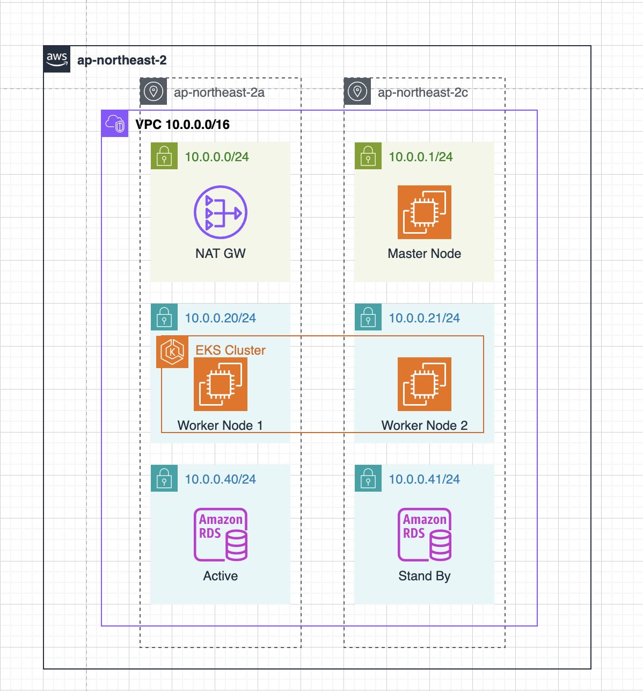
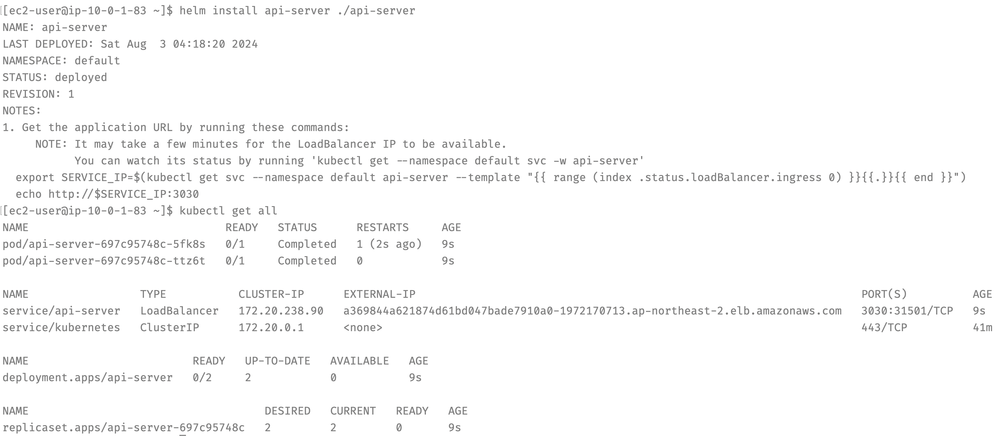
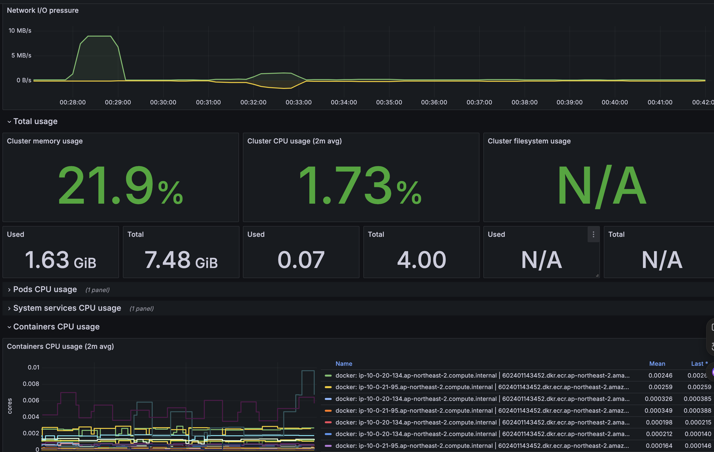

# EKS

- 

- 퍼블릭 클라우드 AWS에 인프라를 구축했습니다.

- 2개의 가용영역을 사용해 이중화하여 고가용성을 확보했습니다.

- 두개의 퍼블릭 서브넷을 생성했고 하나의 서브넷엔 NAT GW를 다른 서브넷에는 EKS의 마스터 노드 역할을 할 EC2 인스턴스를 생성했습니다.

- 4개의 프라이빗 서브넷을 생성했고 EKS 클러스터는 프라이빗 서브넷에 위치하도록 했습니다.

- RDS로 생성한 MySQL서버는 Multi-AZ 옵션을 사용해 다른 가용영역에 백업 DB를 가진 채로 프라이빗 서브넷에 생성되어 있습니다.

# Helm

- 

- Helm Chart를 사용해서 어플리케이션을 배포했습니다. 

- Helm으로 어플리케이션을 배포해보는 것은 처음이었기 때문에 배포 과정은 VPC 내부에 있는 마스터 노드에서 `helm create api-server`명령어로 디렉토리를 생성한 후 values.yaml 부분만 수정하고 `helm install api-server ./api-server`명령어로 배포를 진행했습니다.

- values.yaml에서 수정한 부분은 배포에 대한 내용으로 배포할 이미지 이름, Replica의 수, Service의 타입과 포트 번호로 Ingress, Pod Autoscailing 등의 추가적인 구성은 하지 않았습니다.

- 클러스터는 두개의 워커 노드로 구성되어 있고 크기가 2인 replicaSet을 가지는 Deployment로 구성되어 각 노드에 파드가 한개씩 실행됩니다.

# Terraform

- Terraform으로 어플리케이션 배포를 제외한 나머지 인프라 구축을 자동화했습니다.

- VPC는 공식 문서에서 제공하는 모듈을 사용해서 코드를 줄이고 더 편리하게 구축을 할 수 있었습니다.

- EKS는 모니터링 구축을 염두에 두고 시계열 데이터를 저장할 볼륨 스토리지 연결을 가능하게 하는 AddOn(CSI-driver)을 포함하여 구축했습니다.

- EKS를 구축할때 필요한 IAM 정책과 정책의 연결도 모두 Terraform을 사용해서 진행했습니다.

# 모니터링

- Helm을 사용해서 Prometheus + Grafana를 설치하고 모니터링을 구축했습니다.

- 구축 과정은 VPC 내에 있는 마스터 노드에서 Helm repo를 추가하여 설치했고 설치 과정에서 기본적인 설치 튜토리얼 외 별도의 추가 설정은 없었으며 클러스터 내의 전체 리소스의 사용량에 대한 모니터링을 구성하였습니다.

- 어플리케이션을 특정하여 모니터링을 구성하거나 알람 설정과 같은 추가적인 작업은 하지 않았습니다.

```bash
# add prometheus Helm repo
helm repo add prometheus-community https://prometheus-community.github.io/helm-charts

# add grafana Helm repo
helm repo add grafana https://grafana.github.io/helm-charts

# 프로메테우스 설치
kubectl create namespace prometheus
helm install prometheus prometheus-community/prometheus \
--namespace prometheus \
--set alertmanager.persistentVolume.storageClass="gp2" \
--set server.persistentVolume.storageClass="gp2"

# 프로메테우스가 수집하는 데이터를 grafana의 datasource로 명시
mkdir ${HOME}/grafana

cat << EoF > ${HOME}/grafana/grafana.yaml
datasources:
  datasources.yaml:
    apiVersion: 1
    datasources:
    - name: Prometheus
      type: prometheus
      url: http://prometheus-server.prometheus.svc.cluster.local
      access: proxy
      isDefault: true
EoF

# 그라파나 설치
kubectl create namespace grafana
helm install grafana grafana/grafana \
    --namespace grafana \
    --set persistence.storageClassName="gp2" \
    --set persistence.enabled=true \
    --set adminPassword='Mon!tor123' \
    --values ${HOME}/grafana/grafana.yaml \
    --set service.type=LoadBalancer

```

- 대시보드는 Grafana에서 기본으로 제공되는 대시보드를 Import해서 EKS 클러스터 내 모든 파드, 컨테이너의 CPU, 메모리, 스토리지, 네트워크 I/O를 모니터링 할 수 있도록 했습니다.

- 